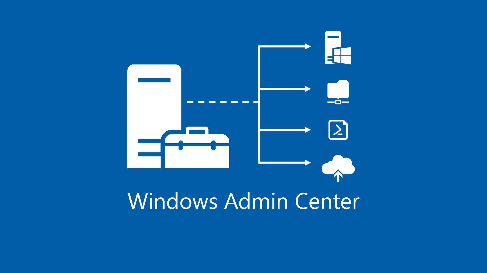
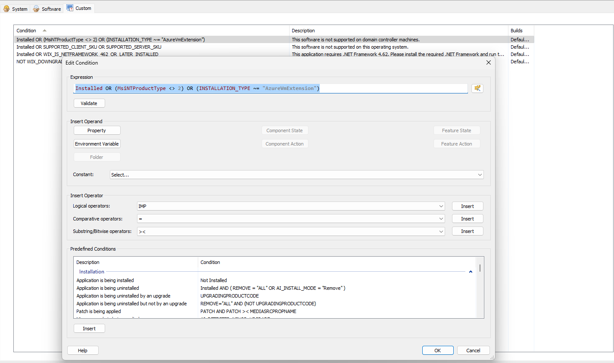
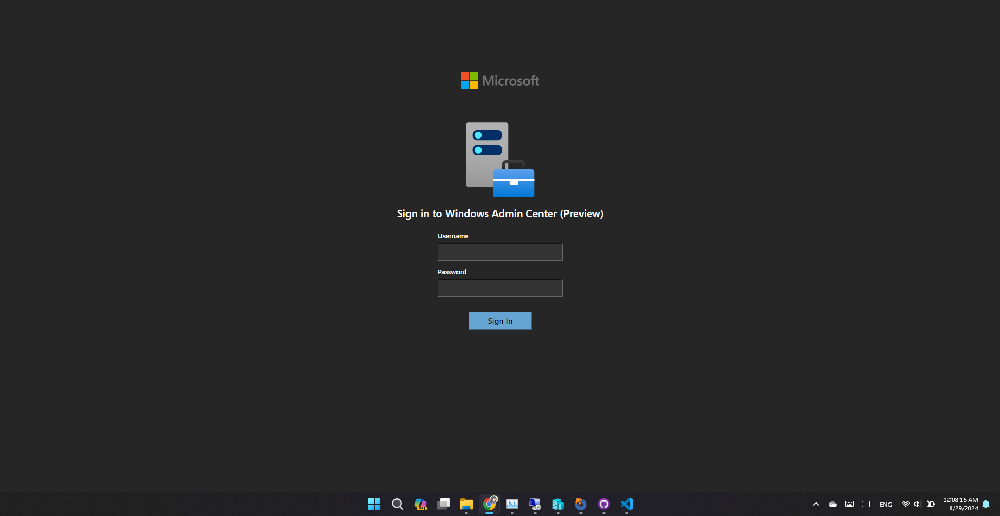

> :warning:
>
> Warning: Installing Windows Admin Center on DC is NOT recommended because of these problems:
>
> 1. The installer may modify your security settings (in WinRM, Registries, etc.)
> 2. It leaves an opening port for connection - which is not good
> 3. WAC always lets the first connection be installed on the machine. In this case, it is your DC. Once someone can access the portal, the attacker can easily attack the whole Active Directory site.

# Why do we need to install Windows Admin Center on Domain Controller?



Recently, I have worked with my team to deploy some demo apps onto our own only empty server **(No Operating System was installed)**. We bought **Windows Server 2022 Datacenter** from Microsoft, installed it, and promoted it to Domain Controller. Everything looked fine, ADCS, ADDS, DNS, and other roles and features work perfectly. And then we thought we could install Windows Admin Center onto our servers, for remoting the servers from either Microsoft Edge or Google Chrome.

We don't want to use other servers, because my team decided to leave it for other teams and other researchers.

And then, as you know, we **CANNOT INSTALL WAC** on **WINDOWS SERVER**. As Microsoft claimed:

```shell
Installing Windows Admin Center on a Domain controller is not supported. Read more about domain controller security best practices.
```

As the engineering leader, I wouldn't accept this result, so I did a small research on the Windows Admin Center installation and tried to modify it.

## On Windows Admin Center (v1?)

Windows Admin Center bundled with `.msi` file. Kinda easy to open and modify it with some tools.

Turns out, the code blocks the installation is simple like this:



```shell
Installed OR (MsiNTProductType <> 2) OR (INSTALLATION_TYPE ~= "AzureVmExtension")
```

Where `MsiNTProductType <> 2` means the launch condition mustn't run on Windows NT Type 2.

Following this instruction, I could easily figure it out.

Then I modified the condition into this:

```shell
Installed OR (MsiNTProductType >= 1) OR (INSTALLATION_TYPE ~= "AzureVmExtension")
```

Save the MSI, then move it into the Domain Controller and install it.

## On Windows Admin Center (Modernized Gateway)

The modernized gateway is much better, with no installation restriction at first. However, as I mentioned earlier, WAC is not fully supported on Domain Controller, so there wasn't be fully properly installed. Whenever I tried to install it onto my DC, I always received the same error messages:

```shell
XXXX/XX/XX XX:XX:XX Level=ERROR ExitCode=1 Message=Register-WACLocalCredSSP: Failed to register CredSSP session configuration.

XXXX/XX/XX XX:XX:XX ExitCode=1 Message=Enable-WACPSRemoting: Failed to configure PowerShell Remoting. Error: Access is denied.
```

Tracking for the installation procedures, I figured out the `Register-WACLocalCredSSP` and `Enable-WACPSRemoting` are from this file:

```markdown
C:\Program Files\WindowsAdminCenter\PowerShellModules\Microsoft.WindowsAdminCenter.Configuration\Microsoft.WindowsAdminCenter.Configuration.psm1
```

I modified a [few lines of it](https://github.com/shiroinekotfs/WAC-on-DC/commit/8ab29da13b85b2533e01db0f6216fc86cb853c97), then ran it, then start the Windows Admin Center.

```powershell
Import-Module .\Microsoft.WindowsAdminCenter.Configuration.psm1
Enable-WACPSRemoting
Register-WACLocalCredSSP
```

And, IT WORKS!



## Okay, I don't have a good MSI editor?

No worry, I have updated everything in [this GitHub repo](https://github.com/shiroinekotfs/WAC-on-DC/commit/8ab29da13b85b2533e01db0f6216fc86cb853c97). You can try old-modified WAC, or download modified script for private uses.

You're welcome~~

> Don't forget to follow me on social media.
>
> Shiroi Neko - Software Engineer and A wannabe Microsoft MVP.
